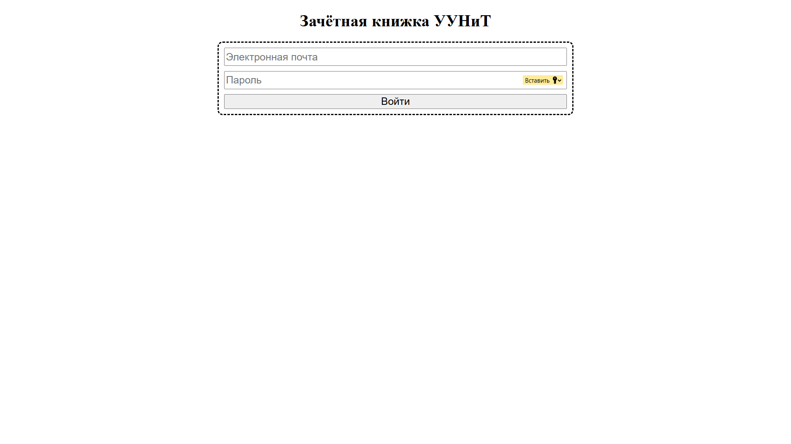
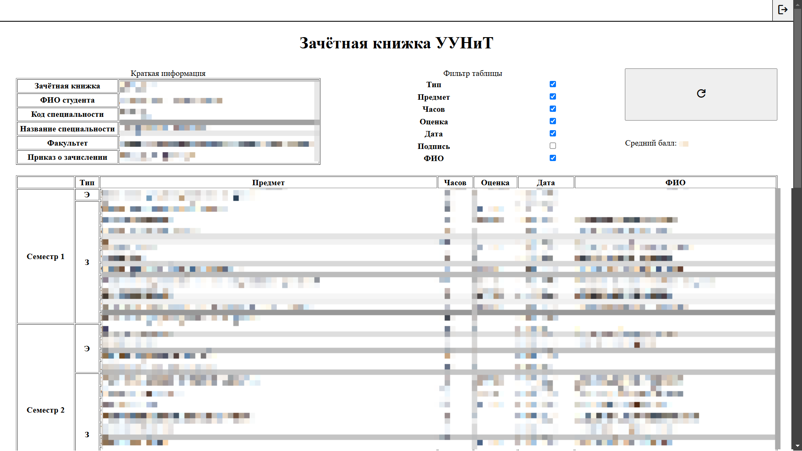

# marks_checker

Сайт для проверки оценок в ИСУ УУНиТ

## Сборка и запуск проекта

Необходимо создать файл с переменными окружения (`.env`) рядом с файлом Dockerfile

Необходимые переменные окружения:

* `FLASK_TOKEN`
* `MYSQL_DATABASE`
* `MYSQL_USER`
* `MYSQL_PASSWORD`
* `MYSQL_ROOT_PASSWORD`
* `DATABASE_URL`

К счастью, Docker сам настроит MySQL-сервер.

Далее достаточно запустить файл build.sh с правами администратора:

``sudo build.sh``

## Регистрация

Для регистрации используются логин и пароль от личного кабинета ИСУ УУНиТ

## Таблица оценок

После успешной регистрации высвечивается краткая информация о студенте, таблица оценок и средний балл

## Фильтр таблицы

Некоторая информация может быть избыточной, поэтому пользователь может скрывать некоторые столбцы

## Выход

В правом верхнем углу есть кнопка выхода. Она позволит пользователю выйти из аккаунта, отчего его отправят на поле с регистрацией

## Особенности

Проект был сделан на библиотеке Flask.

Основной СУБД является MySQL. В коде взаимодействие происходит с помощью SQLAlchemy.

При перезапуске данные сохраняются за счёт использования томов (Docker-volumes).
